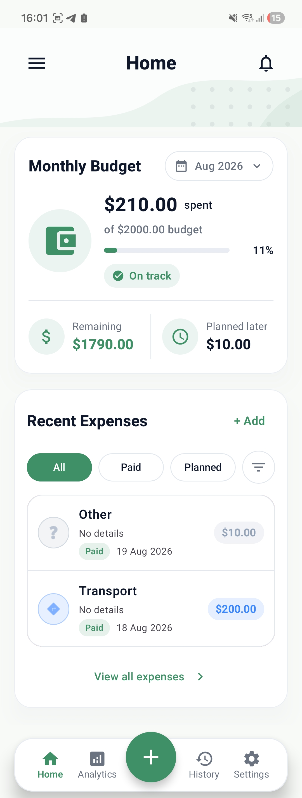
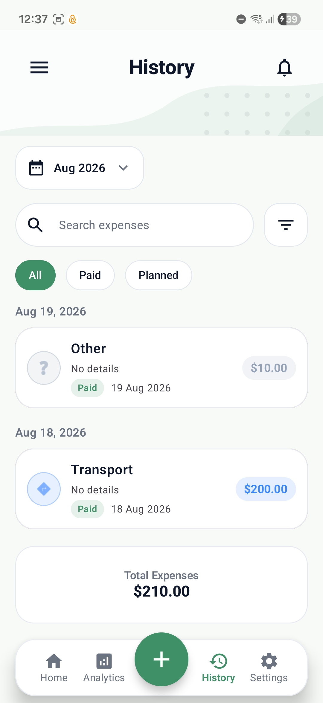
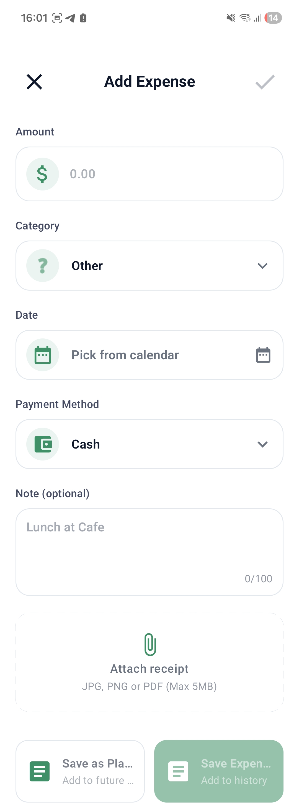

# Expense Tracker – Offline-First Cloud-Synced Android App

A production-ready expense tracking app built with Clean Architecture, MVVM, Room, Firebase Auth, and Firestore, designed to demonstrate scalable Android architecture and cloud synchronization strategies.

## Tech Stack

- Language: Kotlin
- UI: Jetpack Compose
- Architecture: Clean Architecture + MVVM
- Dependency Injection: Hilt
- Local Storage: Room
- Cloud: Firebase Auth + Firestore
- Async: Coroutines + Flow
- Testing: JUnit + MockK
- CI/CD: GitHub Actions

## Architecture

This project follows Clean Architecture principles:

Presentation Layer
- Compose UI
- ViewModels
- UI State management (StateFlow)

Domain Layer
- UseCases
- Business logic
- Repository interfaces

Data Layer
- Room (local source)
- Firestore (remote source)
- Repository implementations

## Features

Core
- Add / Edit / Delete expenses
- Categories
- Filtering & Search

Advanced
- Monthly analytics
- Category breakdown
- Dark mode
- Offline-first sync
- Conflict resolution strategy

## Testing

- Unit tests for UseCases
- ViewModel tests with coroutine testing
- Repository tests with fake data sources
- CI runs tests on every PR

## CI/CD

This project uses GitHub Actions to:
- Build project on every push
- Run unit tests
- Verify lint rules

## Screenshots

  
  
  

